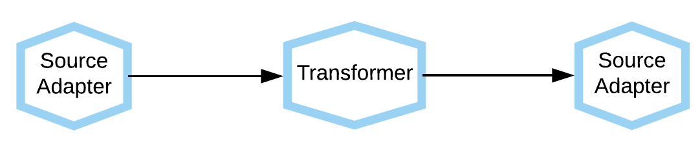
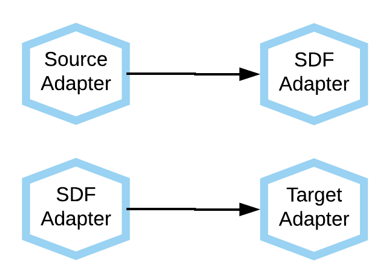
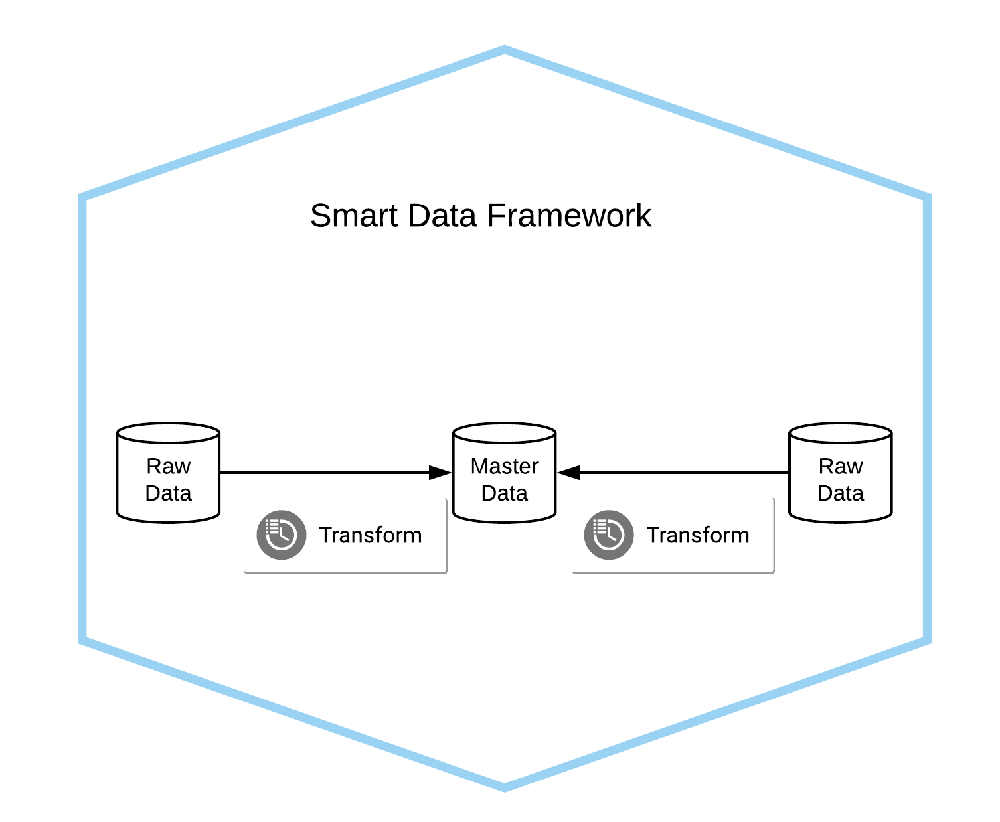

A most simple integration flow running on the integration services is shown in the following diagram.

In the flow above some data from a source system are synchronised to a target system. An
`Adaptor` is retrieving new or changed objects from a source system. These data transformed
by a `Transformer` before they are passed to another `Adaptor` for inserting them into the
target system. Some of the advantages of such `peer-to-peer` integrations are:

* The transformation made in the `Transformer` of a peer-to-peer flow is specific to the
given flow. Two integrators synchronising data between same source and target systems may
decide to transform same data in two different way. Especially integrations of enterprise
systems require a lot of customisation for each tenant.
* Real-time integrations require a synchronous integration flows that respond to requests
within milliseconds. For example a chatboot application sends a HTTP request to an integration
flow to look up some data in a given system. The integration flow sends back the response
which is interpreted by the chatboot and presented to the user in the UI.

In some use cases, such as market places, data  synchronised between applications of a certain
domain area need to be standardised. This can be accomplished by a reusable `Transformer`
used in multiple integration flows. This is where the `Smart Data Framework` comes into play.
The framework is responsible for following functionality:

* management of data models (proprietary models of adapters and master models for certain domains)
* transformation of data between models (e.g. proprietary model into a master mode & vise versa)
* exposing a REST API for communication

Let's explore the integration flow above but now using `Smart Data Framework`.

As you can see above the flow is split into flows so that the process consist now of following steps:

1. An trigger adapter is retrieving data format from a source system and sends them `raw` (in the source systems
proprietary format) to an action adapter for `Smart Data Framework`
2. `Smart Data Framework` transforms the raw data into master format, resolves conflicts, performs de-duplication, etc, and stores them.
3. A trigger adapter for `Smart Data Framework` is retrieving the data from `Smart Data Framework` and sends them to the adapter for the target system. Please note that the data are retrieved from `Smart Data Framework` in raw format.

# Smart Data Framework

Now let's explore the `Smart Data Framework` in details. The following diagram demonstrates its internal details:

# REST API

The micro-service for the `Smart Data Framework` exposes a REST API with following resources:

* `/data`: This resources is used by the adapter for the `Smart Data Framework`. Only `POST` is supported to send data to be saved in a raw table
* `/models`: CRUD operations on models (raw and master data)
* `/events`: Used by adapter for the `Smart Data Framework` to subscribe to changes in master data tables

TODO: provide a Swagger descriptor for the API