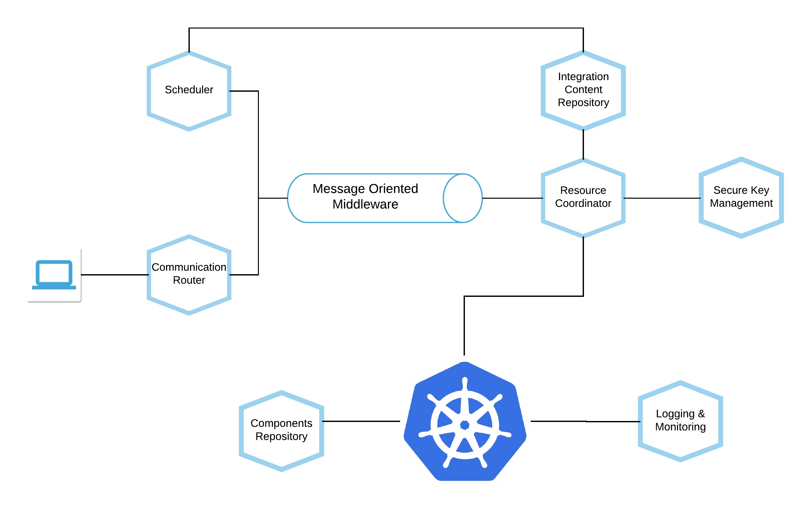

# Integration Hub Microservices

## Integration Component (Adapter) Repository

The integration components are lightweight and stand-alone Docker images that include everything needed to run the
component, including the component's code, a runtime, libraries and dependencies. The component images are stored in an
[Integration Component Repository](./IntegrationComponentRepository.md)

## Communication Router

The communication router is used to expose externally-reachable URLs for integration flows that can be used to implement
webhook-triggered flows. See more details on [Communication Router](./CommunicationRouter.md).

## Scheduler and Resource Coordinator
## Logging & Monitoring
## Message Oriented Middleware
## Secure-Key-Management