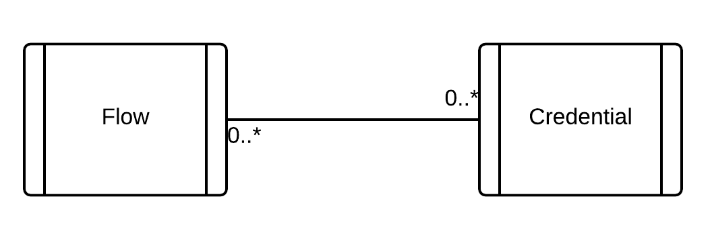

# Secure-Key-Management

An integration flow defines how data flow between various external systems
and how these data are transformed between steps of that flow. However an
integration flow does not define how to connect to these external systems.
Because an integration flow may be deployed to different environments, such
as testing, staging and production. The credentials used to connect to external
systems must be externalized and provided to the flow at runtime.

This is what *Secure-Key-Management* micro-service is for. It is used to
manage users sensible data, such as a connection string to a database, an
API key or an OAuth2 tokens. We will call these sensible data as *credentials*.
A credential has a primary key which is to be referenced from an integration flow,
as shown in the following diagram.

As shown in the diagram above, a Credential is reusable: can be referenced
in multiple integration flows so that the user is not required to create
a new credential for each new flow.

## Encryption of sensible data

The sensible data of an credential are stored in micro-service database
encrypted with AES-256 crypto.

## Protection from stolen identity

A credential has an owner: personal or a group.  If an integration flow
is referencing a credential that does not belong to the flow owner
it is possible to execute the flow on behalf of others and so steal their
identity. It must be ensured that such a flow may neither be persisted nor
executed.

## REST API

The micro-service exposes a simple REST API with the following resources
for management of credentials:

* GET all
* GET by ID
* POST to create
* PATCH to update
* DELETE