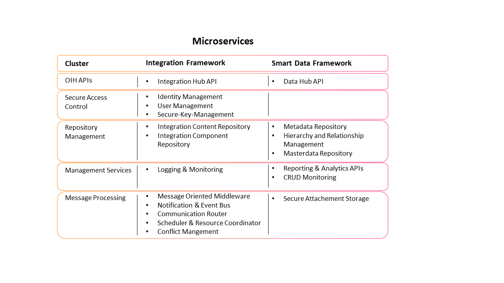
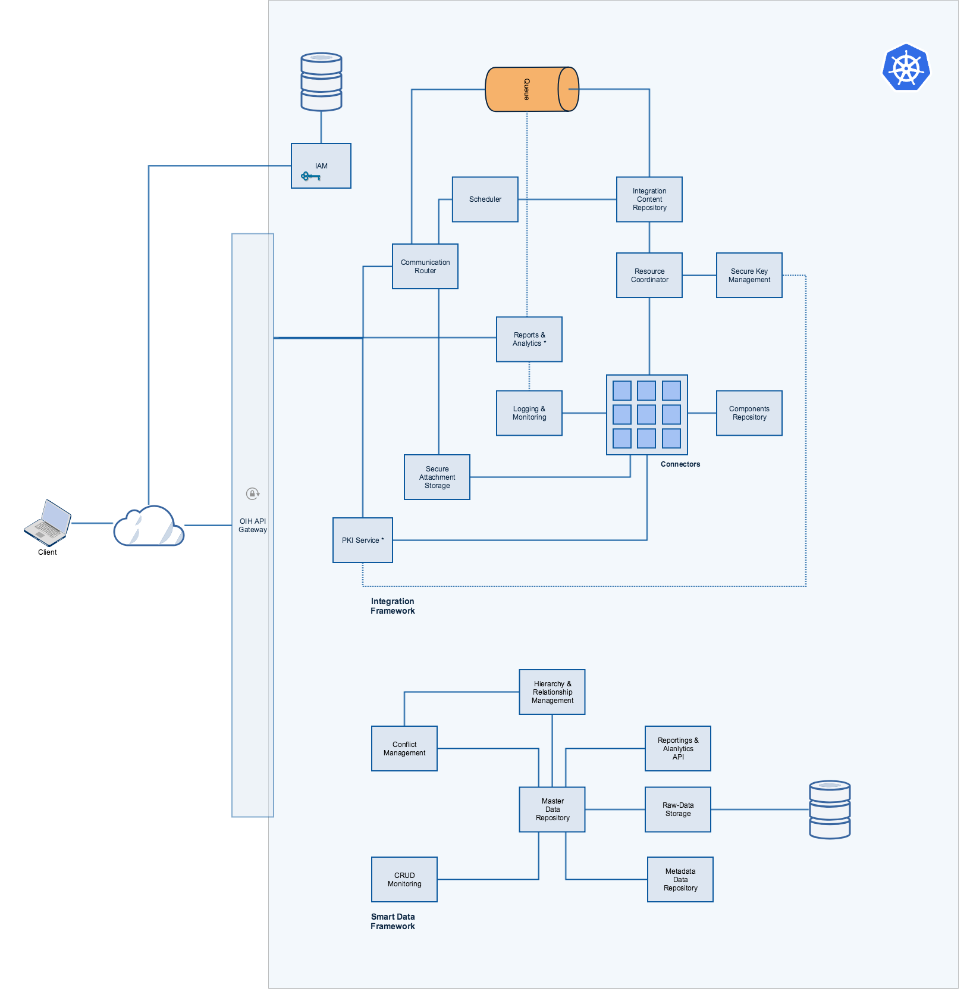

  

The revolution in data synchronization — the Open Integration Hub enables simple data synchronization between any software applications and thus accelerates digitalisation

Visit the official [Open Integration Hub homepage](https://www.openintegrationhub.de/)

# Microservices

## Table of Content
<!-- TOC depthFrom:2 depthTo:6 withLinks:1 updateOnSave:1 orderedList:0 -->

- [Table of Content](#table-of-content)
- [Introduction](#introduction)
- [Contribution](#contribution)
	- [Contribution Guidelines](#contribution-guidelines)
	- [Code of Conduct](#code-of-conduct)
- [Contact](#contact)
- [Content](#content)
	- [Folders](#folders)
	- [Documents](#documents)
- [Microservice Overview](#microservice-overview)
	- [Integration Component (Adapter) Repository](#integration-component-adapter-repository)
	- [Scheduler and Resource Coordinator](#scheduler-and-resource-coordinator)
	- [Communication Router](#communication-router)
	- [Logging & Monitoring](#logging-monitoring)
	- [Message Oriented Middleware](#message-oriented-middleware)
	- [Secure-Key-Management](#secure-key-management)
	- [Integration Content Repository](#integration-content-repository)
	- [Identity and Access Management](#identity-and-access-management)
- [Workgroup](#workgroup)
	- [Information](#information)
	- [Member](#member)
		- [OIH APIs](#oih-apis)
		- [Secure Access Control](#secure-access-control)
		- [Repository Management](#repository-management)
		- [Message Processing](#message-processing)
		- [Management Services](#management-services)
- [Wording](#wording)
- [Contribution](#contribution)

<!-- /TOC -->

## Introduction

This repository contains all developing tasks considering the finalisation of the OIH api integration platform prototype,  including the
core components "Integration Services" and "Data Hub".  Additionally, this repository includes the development of the microservices and the primary purpose is to develop the platform prototype as the basis for further use.

## Contribution
### Contribution Guidelines
Before you contribute please read our [contribution guidelines](CONTRIBUTING.md).

### Code of Conduct

To see how members of the community are expected to behave, please read the [code of conduct](CODE_OF_CONDUCT.md). We apply the code of conduct defined by the Contributor Covenant, which is used across many open source projects, such as [NodeJS](https://github.com/nodejs/node), [Atom](https://github.com/atom/atom) and [Kubernetes](https://github.com/kubernetes/kubernetes).

## Contact
When looking for further information or support, please contact: philipp.hoegner@cloudecosystem.org.

## Content

The following illustration shows how the microservices are aggregated within the workgroups:

### Folders

- [ManagementServices](ManagementServices): Contains all concepts for management services such as logging and monitoring, reporting and analytics
- [MessageProcessing](MessageProcessing): Includes all descriptions regarding message processing, communication router, scheduler and the resource coordinator
- [OihAPIs](OihAPIs): Describes the Open Integration Hub REST-APIs i.e. integration framework api and smart data framework api, which allows corresponding  managing of the OIH platform
- [Protocols](Protocols): Collection of all taken protocols
- [RepositoryManagement](RepositoryManagement): Contains all repository service concepts such as Integration Component- and Content Repository
- [SecureAccessControl](SecureAccessControl): Includes microservices to manage secure access. This includes the Identity-, User- and Secure-Key-Management

### Documents

- [CONTRIBUTING](CONTRIBUTING.md): Contains the contribution guideline
- [DataHub](DataHub.md): Describes the concept of the smart data framework, using adapters/ transformer and a smart data framework adapter
- [InfrastructureAndTechnologies](InfrastructureAndTechnologies.md): Lists the technologies used in the OIH and the motivation behind them
- [IntegrationServices](IntegrationServices.md): Includes an overview of the intergration framework services as well as a short description for each microservice. It describes the integration into the kubernetes environment with message oriented middleware as the basis for communication
- [MicroserviceDescriptionTemplate](MicroserviceDescriptionTemplate): Gives a brief overview of what a microservice description should look like  
- [MicroserviceOverview](MicroserviceOverview.md): Table of all integration framework microservices with their company in charge and the official deadline
- [TestingTools](TestingTools.md): Table of possible testing tools with their main feautures

## Microservice Overview

### Integration Component (Adapter) Repository

The integration components are lightweight and stand-alone Docker images that include everything needed to run the
component, including the component's code, a runtime, libraries and dependencies. The component images are stored in an
integration component repository ([RepositoryManagement/Integration Component Repository](RepositoryManagement/IntegrationComponentRepository.md)).

### Scheduler and Resource Coordinator

There are two ways to trigger a flow execution: to poll changes periodically or to receive notifications through webhooks.
The majority of integration flows poll perform polling as the most of APIs out there don't support webhooks. The polling
is performed periodically with the help of the *Scheduler*. 
Because Integration Hub is a multi-tenant environment, it is theoretically possible that some tenants cause starvation
of others through an unfair usage of shared resources. The *Resource Coordinator* enforces  every tenant to comply with
the defined policies on resource sharing.

Please read more details on scheduler and resource coordinator ([MessageProcessing/SchedulerResourceCoordinator](MessageProcessing/SchedulerResourceCoordinator.md)).

### Communication Router

In contrast to polling a flow can be started by an external event. Modern APIs provide support for webhooks in order to
avoid wasting of resources when polling. The external system can be configured with a webhook url to be called upon
changes in the external system. The *Communication Router* is used to expose externally-reachable URLs for integration
flows that can be used to implement webhook-triggered flows. These URLS may be registered in external systems to sent
notifications to. See more details on communication router ([MessageProcessing/CommunicationRouter](MessageProcessing/CommunicationRouter.md)).

### Logging & Monitoring

Integration Hub micro-services and integration flows are running in a Kubernetes
cluster. Read details on cluster-level logging architectures ([ManagementServices/LoggingMonitoring](ManagementServices/LoggingMonitoring.md)).

### Message Oriented Middleware

All the communication between steps of an integration flow in runtime is happening through a message broker. Two steps
of an integration flow are separate Docker container isolated from each other. They are connected through a messaging
queue than provides them a reliable and asynchronous communication protocol. See more details on  message oriented middleware ([MessageProcessing/MessageOrientedMiddleware](MessageProcessing/MessageOrientedMiddleware.md)).

### Secure-Key-Management

An integration flow defines how data flow between various external systems and how these data are transformed between
steps of that flow. However an integration flow does not define how to connect to these external systems. An integration
can be considered as a clonable template that must not contain any sensible user data, such as API credentials. The API
credentials are stored in the secure-key-management ([SecureAccessControl/SecureKeyManagement](SecureAccessControl/SecureKeyManagement.md)).

### Integration Content Repository
TBD... See [/RepositoryManagement/IntegrationContentRepository](/RepositoryManagement/IntegrationContentRepository.md)

### Identity and Access Management
TBD... See [/SecureAccessControl/IAMConcept.md](/SecureAccessControl/IAMConcept.md)

## Workgroup
### Information
- Each workgroup has at least one **status call** every two weeks
- **Every Committer** must attend the status call
- The governance model defines the workgroup members' roles into managers, committers or contributors

### Member

#### OIH APIs
|Member Name |GitHub Alias|Company| Role |
| --- | --- | --- | --- |
| Igor Drobiazko  |[drobiazko](https://github.com/drobiazko)|[Elastic.io](https://www.elastic.io/)| **Manager**  |
| Selim Achmerzaev |[sachmerz](https://github.com/sachmerz)|[Basaas](https://www.basaas.com/app-store)| Committer  |
| Philipp Hoegner|[philecs](https://github.com/philecs)|[Cloud Ecosystem](http://www.cloudecosystem.org/)| Committer |
| Pavel Nedelko|[pnedelko](https://github.com/pnedelko)|[Elastic.io](https://www.elastic.io/)| Contributor|

#### Secure Access Control
|Member Name |GitHub Alias|Company| Role |
| --- | --- | --- | --- |
| Selim Achmerzaev |[sachmerz](https://github.com/sachmerz)|[Basaas](https://www.basaas.com/app-store)| **Manager**  |
| Igor Drobiazko  |[drobiazko](https://github.com/drobiazko)|[Elastic.io](https://www.elastic.io/)| Committer  |
| Philipp Hoegner|[philecs](https://github.com/philecs)|[Cloud Ecosystem](http://www.cloudecosystem.org/)| Committer |
| Lutz Ashauer |[lashauer](https://github.com/lashauer)|[StoneOne](http://stoneone.de)| Contributor  |
| Falk Voigt |[falkvoigt](https://github.com/falkvoigt)|[Basaas](https://www.basaas.com/app-store)| Contributor  |
| Hans Eggert |[heggert](https://github.com/heggert)|[Basaas](https://www.basaas.com/app-store)| Contributor  |
| Pavel Nedelko|[pnedelko](https://github.com/pnedelko)|[Elastic.io](https://www.elastic.io/)| Contributor|

#### Repository Management
|Member Name |GitHub Alias|Company| Role |
| --- | --- | --- | --- |
| Igor Drobiazko  |[drobiazko](https://github.com/drobiazko)|[Elastic.io](https://www.elastic.io/)| **Manager**  |
| Selim Achmerzaev |[sachmerz](https://github.com/sachmerz)|[Basaas](https://www.basaas.com/app-store)| Committer  |
| Hansjörg Schmidt  |[hschmidthh](https://github.com/hschmidthh)|[Wice](https://wice.de/)| Committer  |
| Philipp Hoegner|[philecs](https://github.com/philecs)|[Cloud Ecosystem](http://www.cloudecosystem.org/)| Committer |
| Lutz Ashauer |[lashauer](https://github.com/lashauer)|[StoneOne](http://stoneone.de)| Contributor  |
| Susanne Braun |[brausu](https://github.com/brausu)|[Fraunhofer IESE](https://www.iese.fraunhofer.de/)| Contributor  |
| Shterion Yanev | [spyanev](https://github.com/spyanev) |[Wice](https://wice.de/)| Contributor  |
| Pavel Nedelko|[pnedelko](https://github.com/pnedelko)|[Elastic.io](https://www.elastic.io/)| Contributor|

#### Message Processing
|Member Name |GitHub Alias|Company| Role |
| --- | --- | --- | --- |
| Igor Drobiazko  |[drobiazko](https://github.com/drobiazko)|[Elastic.io](https://www.elastic.io/)| **Manager**  |
| Selim Achmerzaev |[sachmerz](https://github.com/sachmerz)|[Basaas](https://www.basaas.com/app-store)| Committer  |
| Philipp Hoegner|[philecs](https://github.com/philecs)|[Cloud Ecosystem](http://www.cloudecosystem.org/)| Committer |
| Susanne Braun |[brausu](https://github.com/brausu)|[Fraunhofer IESE](https://www.iese.fraunhofer.de/)| Contributor  |
| Shterion Yanev | [spyanev](https://github.com/spyanev) |[Wice](https://wice.de/)| Contributor  |
| Hansjörg Schmidt  |[hschmidthh](https://github.com/hschmidthh)|[Wice](https://wice.de/)| Contributor  |
| Pavel Nedelko|[pnedelko](https://github.com/pnedelko)|[Elastic.io](https://www.elastic.io/)| Contributor|

#### Management Services
|Member Name |GitHub Alias|Company| Role |
| --- | --- | --- | --- |
| Selim Achmerzaev |[sachmerz](https://github.com/sachmerz)|[Basaas](https://www.basaas.com/app-store)| **Manager**  |
| Igor Drobiazko  |[drobiazko](https://github.com/drobiazko)|[Elastic.io](https://www.elastic.io/)| Committer  |
| Philipp Hoegner|[philecs](https://github.com/philecs)|[Cloud Ecosystem](http://www.cloudecosystem.org/)| Committer |
| Lutz Ashauer |[lashauer](https://github.com/lashauer)|[StoneOne](http://stoneone.de)| Contributor  |
| Shterion Yanev | [spyanev](https://github.com/spyanev) |[Wice](https://wice.de/)| Contributor  |
| Pavel Nedelko|[pnedelko](https://github.com/pnedelko)|[Elastic.io](https://www.elastic.io/)| Contributor|
| Falk Voigt |[falkvoigt](https://github.com/falkvoigt)|[Basaas](https://www.basaas.com/app-store)| Contributor  |
| Hans Eggert |[heggert](https://github.com/heggert)|[Basaas](https://www.basaas.com/app-store)| Contributor  |

## Wording

Within the project different terms and abbreviations are frequently used. All terms and abbrevations are explained within the [glossary](https://github.com/openintegrationhub/Connectors/wiki/Glossary) and our [list of abbrevations](https://github.com/openintegrationhub/Connectors/wiki/Abbreviations).

## Contribution

Before you contribute, please read the [contribution guideline](https://github.com/openintegrationhub/microservices/blob/master/CONTRIBUTING.md).
